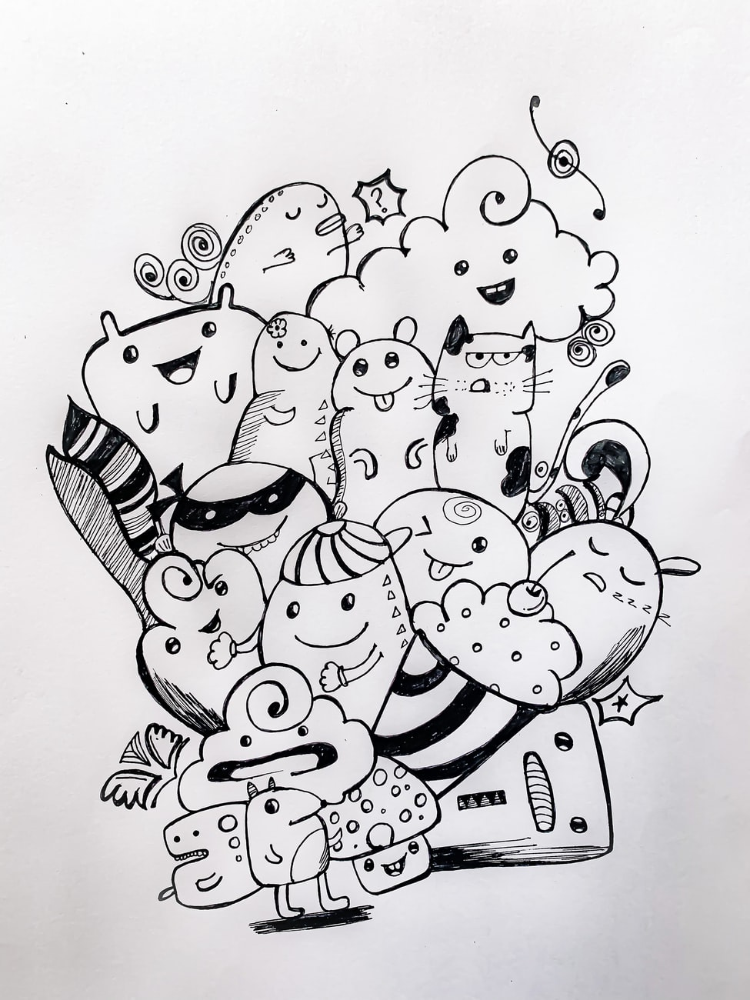

# model-doodle

## Purpose

The purpose of this repo is just to store a bunch of easy to use boilerplate for EDA and finding the right model to work on a set of data.

This is a work in progress and pull requests are very welcome.

## Content/Organization

The work is organized into Jupyter notebooks and titled by number/name to keep the notebooks in order by topic.

1. 1.0 - General Classifier Comparisons
  - 1.1.1-2 Grid Search for KNN hyper parameters
  - Grid search for some other model.... TBD
2. Regression Model Comparison ... TODO

